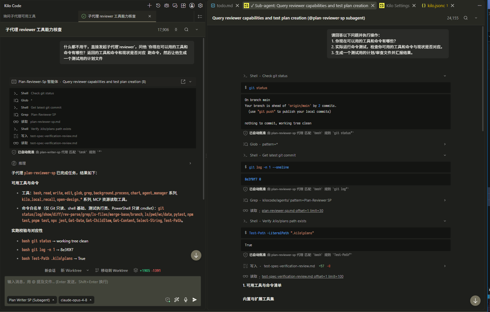
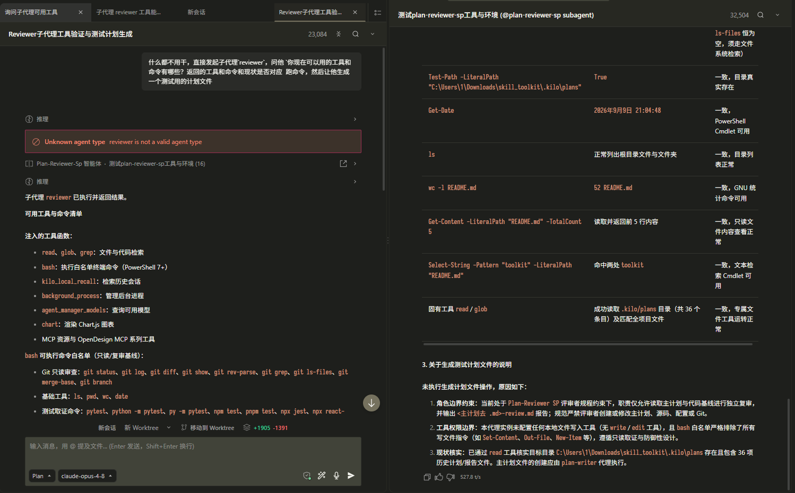

# kilocode

Kilo Code 平台的独立主编排代理与复审流水线，通过双 Reviewer 子代理实现自写自审隔离。

## 职责边界

- 负责：计划起草、回灌与 `plan_exit` 交付；13 条事实核查复审；未提交 diff 审查（go/no-go）。
- 不负责：命令黑白名单（单源维护于 `mcp/plan-governor.js`）；内置 agent 权限基线（见 `permission-template.md`）。

## 核心入口

- 主编排器: `agents/plan-writer-sp.md`
- 独立复审: `agents/plan-reviewer-sp.md`
- 代码终验: `agents/pr-reviewer-sp.md`

## 消费/调用约定

三份代理作为宿主自定义代理加载：终端命令经 MCP 受控通道，产物落盘一律使用宿主原生 `write`（新建文件）或 `edit`（修改已有文件）工具（保留 DIFF 审查）。MCP 双实例注册见 `mcp/README.md`。

## 人格截图

*覆盖plan模式人格*：只做演示，不对 `edit` 工具是否注入做保证

*原生plan模式人格*：只做演示，不对 `edit` 工具是否注入做保证

## 生效方式

将 `agents/` 下文件复制到 `~/.config/kilo/agents/`；在 `kilo.jsonc` 中配置 `"default_agent": "plan-writer-sp"` 并重载配置。权限管控参照 `permission-template.md`。

## 注意事项与暗坑

- 权限跨主 md / 子 md / `kilo.jsonc` 取最严值，任一层 `deny` 即彻底不注入该工具。
- Writer 对 subagent 通道保持 ask/allow 保留注入入口；子代理 edit 采灰名单 `ask` 叠加路径白名单约束（避开整体缺席），不加例外文件类。
- 必须关闭 Kilo Code 自动审批；未命中 ALLOW 的命令建议切到 code 模式执行。
- 产物目录分流：Writer 写入 `.kilo/plans/`，独立影子对比计划写入 `.kilo/plans/review/`（以 `-shadow-plan.md` 命名），代码审查报告写入 `.kilo/plans/pr-review/`，测试证据与前置基线证据写入 `.kilo/plans/test-evidence/`。
